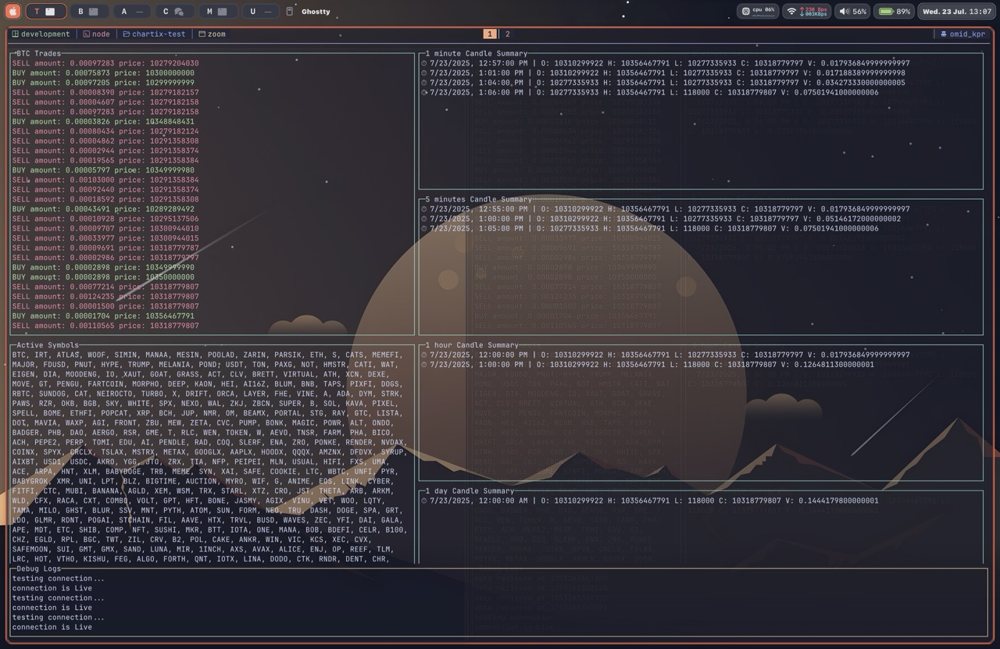

# 📊 terminal market viewer



A terminal-based live cryptocurrency dashboard built with [blessed](https://github.com/chjj/blessed). This project connects to the Bitpin WebSocket API, receives real-time trade updates, and aggregates them into candlesticks for various timeframes (`1m`, `5m`, `1h`, `1d`, `1M`).

## 🚀 Features

- 📈 Real-time candle summaries for multiple timeframes
- 🧱 Real-time trade updates
- 🧭 Live symbol tracking
- 🖥️ Terminal UI powered by `blessed`
- 🧪 Handles WebSocket reconnection & error monitoring

## 🛠️ Tech Stack

- Node.js
- TypeScript
- [blessed](https://github.com/chjj/blessed) for terminal UI
- [ws](https://github.com/websockets/ws) for WebSocket
- [dayjs](https://github.com/iamkun/dayjs) for date utilities

## 📦 Installation

```bash
git clone https://github.com/yourusername/bitpin-terminal-dashboard.git
cd bitpin-terminal-dashboard
npm install
```

## Usage

```bash
npm run dev
```

or

```bash
npm run start
```

The terminal will open and display live candles for "BTC_USDT", "BTC_IRT", "USDC_IRT" (in future your selected pair). Symbols and timeframes are shown in separate boxes.

## 📡 WebSocket Connection

Every trade message contains:

```json
{
  "event": "matches_update",
  "event_time": "2024-08-14T14:37:54.487062Z",
  "matches": [
    {
      "price": "1234567",
      "base_amount": "0.01"
    }
  ]
}
```

Each message is organized into the proper candle bucket based on the event_time.

## 📅 Candle Timeframes

Candles are bucketed based on:

    1m: minute start

    5m: nearest 5-minute start

    1h: hour start

    1d: midnight

    1M: first day of the month

All candles are stored in memory and rendered via renderCandles()

## 📁 Project Structure

📦 src
┣ 📜 index.ts # Entry point, sets up WebSocket and UI
┣ 📜 candles.ts # Candle aggregation and time bucketing
┣ 📜 dashboard.ts # Blessed UI elements and rendering
┣ 📜 utils.ts # Date/time helpers
┗ 📜 types.ts # Type definitions (Match, Candle, etc.)

## 🧰 Scripts

```bash
npm run dev     # Development mode with nodemon
npm run build   # Transpile TS to JS
npm start       # Run the compiled app
```

## Created by Omid

```bash

### ✅ Next Steps

- dynamic market tracking instead of fixed market symbols.
- add more features and make it a complete commandLine tool.
- make it my first npm publish 🎊
```

Let me know how you'd like to personalize this further!
